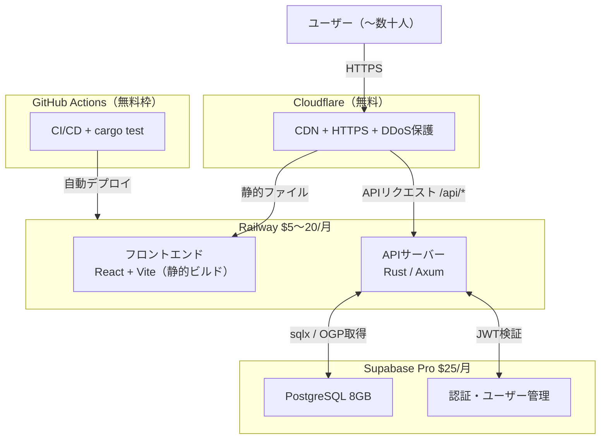

# Task-URL

学習や調べ物をする際にこれまで参照したサイトのリンクを保存しておくためのディレクトリ

```mermaid
graph TB
    UA["ユーザー（〜数十人）"]

    subgraph CF["Cloudflare（無料）"]
        CDN["CDN + HTTPS + DDoS保護"]
    end

    subgraph RAILWAY["Railway $5〜20/月"]
        direction TB
        FRONT["フロントエンド<br/>React + Vite（静的ビルド）"]
        API["APIサーバー<br/>Rust / Axum"]
    end

    subgraph SB["Supabase Pro $25/月"]
        AUTH["認証・ユーザー管理"]
        PG["PostgreSQL 8GB"]
    end

    subgraph GH["GitHub Actions（無料枠）"]
        CICD["CI/CD + cargo test"]
    end

    UA -->|HTTPS| CDN
    CDN -->|静的ファイル| FRONT
    CDN -->|APIリクエスト /api/*| API
    API <-->|sqlx / OGP取得| PG
    API <-->|JWT検証| AUTH
    CICD -->|自動デプロイ| RAILWAY
```

